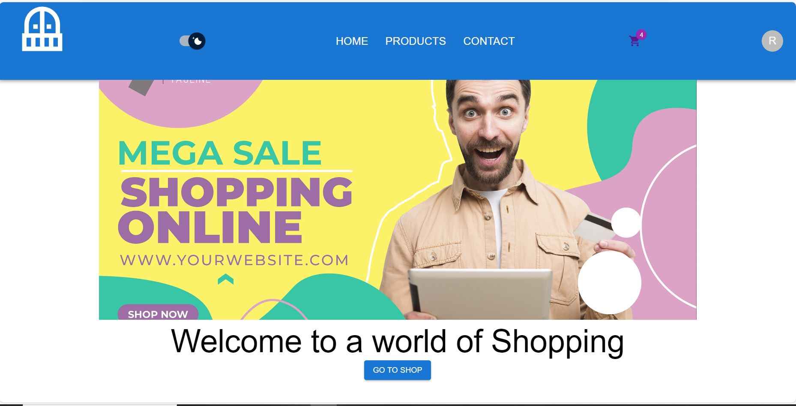
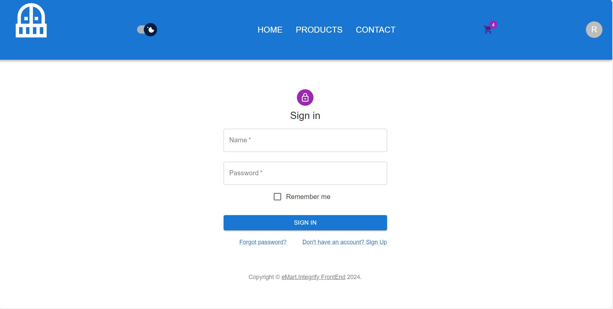

# Frontend project

# eMart

An innovative e-commerce platform designed to simplify your shopping experience. eMart enables users to browse through a wide range of products, manage their shopping cart, register, and login to access personalized features. Crafted with TypeScript and Redux Toolkit for the frontend and robust Node.js will be used in the backend, eMart exemplifies a responsive and user-friendly shopping environment.

## Overview

**Architecture & Technologies:** eMart leverages React, and Node.js for application development. The frontend employs TypeScript and Redux Toolkit for state management, alongside Material-UI for a responsive design.

**Project Structure:** The project is organized into two main sections:

- The emart-frontend directory hosts the React application, incorporating Redux for global state management, Material-UI components for styling, and React Router for navigation.
- The backend directory will contain server configurations, API routes, models, and a database connection setup.

## Features

- **Product Browsing:** Users can view all products, with functionalities to filter by category and sort by price.
- **User Authentication:** Features for user registration and login, enabling personalized experiences like profile management.
- **Shopping Cart:** Functionality to add, update quantity, or remove products from the cart.
- **Admin Features:** Exclusive product management capabilities for application administrators.(Under construction)

## Getting started

### Requirements

- Modern web browser with JavaScript enabled
- Node.js (version 14 or newer)
- MongoDB (version 4.0 or newer)(WIP)

### Quickstart

1. Clone the repository to your local machine.
2. Navigate to the directories to install dependencies using `npm install`.
3. Configure your `.env` files in the respective directories as per provided specifications.
4. Execute `npm start` in the backend directory to launch the server.
5. Concurrently, run `npm start` in the Frontend-project directory to serve the React application.

### Testing

- Run `npm test` in the frontend directory to run the tests.
  -Test is carried out on the product reducers using React testing library and Jest.

### Deployment

-The project is ready to be deployed to Netlify with this link: https://emart-frontend-project.netlify.app/

## License

Copyright (c) 2024.
This repository for the Frontend project to build an e-commerce website.

## Requirements

#####################################################################################################
